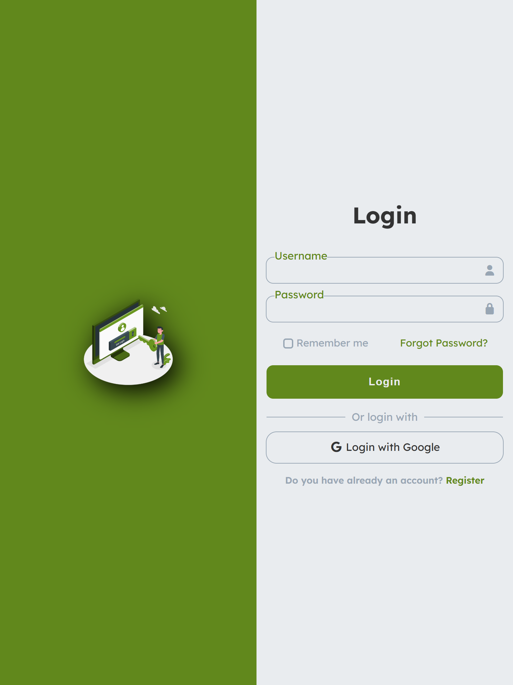
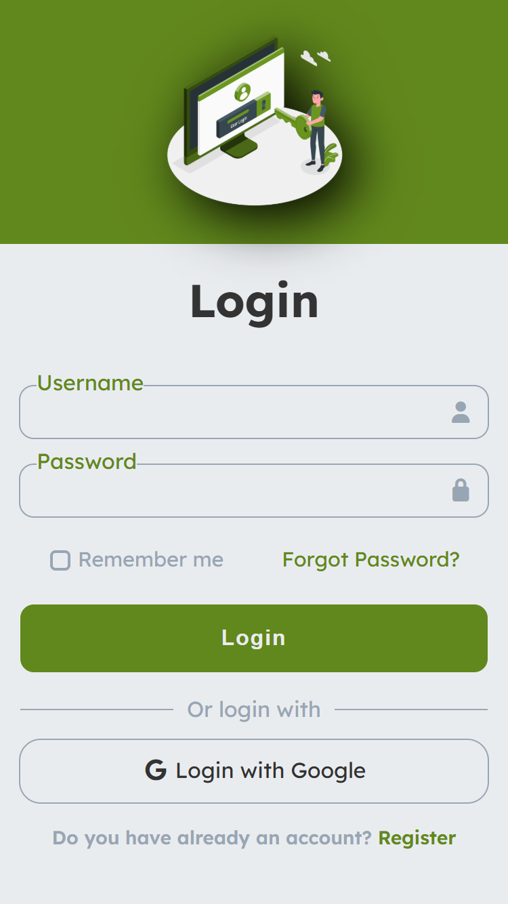
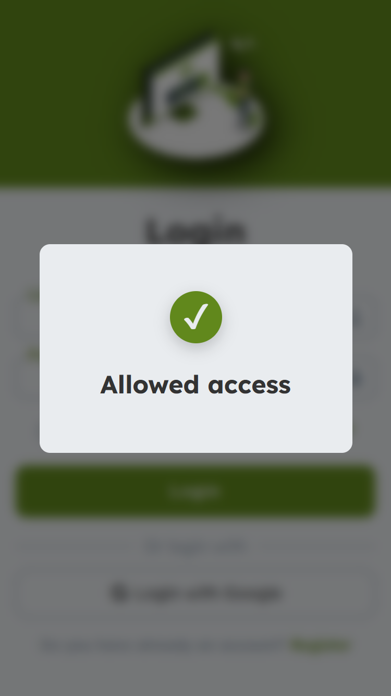

# Login Form UI 🔐

A modern, responsive **Login Form UI** built using **HTML5**, **CSS3** and **JavaScript**, following a **mobile-first** approach.  

This project focuses on clean UI architecture, form validation, user feedback, and smooth animations to simulate a real-world login experience.

This project is part of my daily frontend practice roadmap to strengthen my skills in layout, forms, and UI composition.

---

## 📸 Preview

### Desktop


### Tablet


### Mobile


### Success Modal


---

## 📌 Features

- Mobile-first responsive layout
- Split screen layout for desktop
- Custom styled inputs with icons
- Floating labels
- Custom checkbox
- Google login button
- Form validation (username & password)
- Dynamic error handling
- Animated success modal with feedback
- Smooth UI transitions and animations

---

## 🛠 Technologies Used

- HTML5
- CSS3
- JavaScript (Vanilla JS)
- Font Awesome (icons)
- Google Fonts (Lexend Deca)

---

## 📱 Responsive Design

The layout adapts automatically:

- **Mobile**
  - Image on top
  - Login form below

- **Tablet & Desktop**
  - Split screen layout
  - Image on the left
  - Login form centered on the right

Built using **CSS Grid** and **media queries**.

---

## 🎯 User Experience

This project includes interactive feedback:

- Input validation with visual error states
- Dynamic error messages
- Success modal with animated sequence:
  - Bubble pop effect
  - Icon animation
  - Checkmark confirmation
- Auto-close modal behavior

---

## 📂 Project Structure

```
03-login-form/
│
├── css/
│ └── style.css
├── js/ 
│ └── script.js
├── public/
│ └── img/
├── assets/
│   └── previews/
│       ├── desktop.png
│       ├── mobile.png
│       └── modal.png
├── index.html
└── README.md
```

## 🧪 Versioning

This project follows a simple versioning system:

| Version | Description |
|--------|-------------|
| v1.0 | Initial stable version with full responsive layout |
| v1.1 | Added form validation and dynamic error handling and Implemented animated success modal with feedback |
| v2.0 *(planned)* | CSS refactor using `clamp()`, CSS variables, fluid units and reduced media queries |


## 📈 Learning Goals

This project was created to practice:

- Semantic HTML structure
- Modern CSS layout techniques
- Form validation with JavaScript
- UI feedback and animations
- Responsive design principles
- Version control with Git
- Professional project organization


## 👤 Author

**Raúl Limón**  
Frontend Developer  

- GitHub: [RaulLimon3](https://github.com/RaulLimon3)  
- LinkedIn: https://www.linkedin.com/in/raul-limon-garcia/

## 📄 License

This project is open source and available for learning and portfolio purposes.

## 🧩 Development Stages

The v1.0 release was built in three internal stages:

- v1: Base HTML structure
- v2: Visual styling and UI design
- v3: Responsive layout
